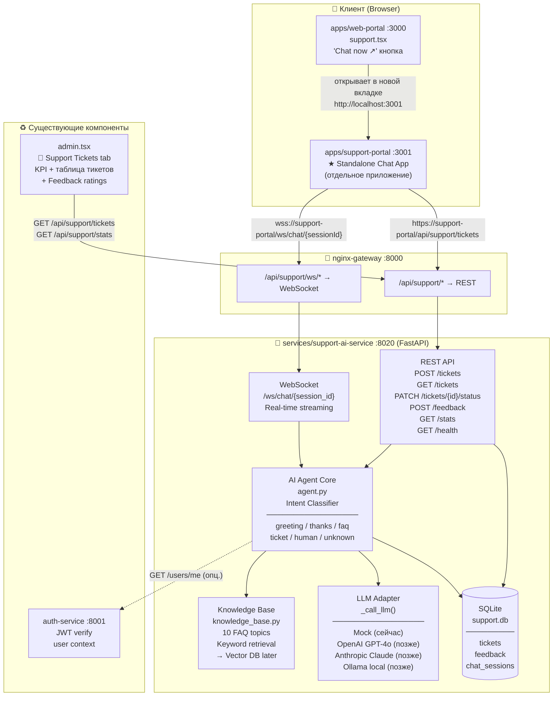

# AI Support System — Architecture & Connection Scheme

**Дата:** March 5, 2026  
**Статус:** Реализовано (Mock LLM, готово к подключению реального провайдера)

---

## Схема подключения



---

## Компоненты

### 1. `apps/support-portal` — Standalone Next.js App (порт 3001)

Отдельное приложение, независимое от основного веб-портала.

| Вкладка | Описание |
| --- | --- |
| **💬 AI Chat** | WebSocket чат с AI агентом, real-time ответы, markdown рендеринг |
| **🎫 Submit Ticket** | Форма поддержки (Email, Category, Priority, Subject, Message) |
| **🟢 System Status** | Статус всех сервисов SelfMonitor |

**Точка входа из web-portal:** `support.tsx` → кнопка "Chat now ↗" → `http://localhost:3001`

---

### 2. `services/support-ai-service` — FastAPI Backend (порт 8020)

#### API Endpoints

| Method | Path | Описание |
| --- | --- | --- |
| `WS` | `/ws/chat/{session_id}` | Real-time AI чат |
| `POST` | `/tickets` | Создать тикет |
| `GET` | `/tickets` | Список тикетов (admin) |
| `PATCH` | `/tickets/{id}/status` | Обновить статус тикета |
| `POST` | `/feedback` | Отправить оценку (1–5 ⭐) |
| `GET` | `/stats` | Статистика (admin) |
| `GET` | `/health` | Health check |

#### AI Agent — Intent Classification

```text
Входящее сообщение
        ↓
Intent Classifier (agent.py)
        ↓
┌───────────┬──────────┬─────────┬────────┬──────────┬─────────┐
│ greeting  │  thanks  │ goodbye │  faq   │  ticket  │  human  │
│  (привет) │ (спасибо)│  (пока) │(вопрос)│(создать) │(оператор│
└───────────┴──────────┴─────────┴────────┴──────────┴─────────┘
                                    ↓          ↓
                              Knowledge    "Use form
                                Base       below"
                              (10 topics)
                                    ↓
                              LLM Adapter
                              (Mock → GPT-4o)
```

#### База знаний (`knowledge_base.py`) — 10 топиков

- Подключение банка (Open Banking)
- Отмена подписки
- Безопасность / GDPR
- HMRC MTD Auto-submission
- Экспорт данных (CSV, PDF, Xero)
- Свободный период (trial)
- Инвойсы / VAT
- Планы и цены (Free/Starter/Growth/Pro/Business)
- Забытый пароль
- Командные аккаунты (Business plan)

---

### 3. nginx Gateway routing (порт 8000)

```nginx
# REST API
location /api/support/ {
    rewrite /api/support/(.*) /$1 break;
    proxy_pass http://support_ai_service;  # → :8020
}

# WebSocket (upgrade required)
location /api/support/ws/ {
    proxy_set_header Upgrade $http_upgrade;
    proxy_set_header Connection "upgrade";
    proxy_read_timeout 3600s;             # держать соединение 1 час
    proxy_pass http://support_ai_service;
}
```

---

### 4. Admin Panel (`admin.tsx`) — вкладка "💬 Support Tickets"

- KPI: Всего тикетов / Открытые / Решено сегодня / Средняя оценка
- Таблица тикетов с цветными приоритетами и статусами
- Таблица отзывов (⭐ + комментарий)
- Кнопка "Open AI Support Portal ↗" → `http://localhost:3001`

---

## Как запустить локально

```bash
# 1. Backend (support-ai-service)
cd services/support-ai-service
pip install -r requirements.txt
SUPPORT_DB_PATH=./support.db uvicorn app.main:app --host 0.0.0.0 --port 8020

# 2. Frontend (support-portal)
cd apps/support-portal
npm install
npm run dev   # → http://localhost:3001

# Или через Docker Compose (всё вместе):
docker compose up --build -d support-ai-service
```

---

## Подключение реального LLM (когда будет ключ)

В файле `services/support-ai-service/app/agent.py`, функция `_call_llm()`:

```python
# OpenAI GPT-4o
import openai
client = openai.OpenAI(api_key=os.getenv("OPENAI_API_KEY"))
messages = [{"role": "system", "content": system_prompt}] + history + [{"role": "user", "content": user_message}]
resp = client.chat.completions.create(model="gpt-4o", messages=messages)
return resp.choices[0].message.content

# Anthropic Claude 3.5 Sonnet
import anthropic
client = anthropic.Anthropic(api_key=os.getenv("ANTHROPIC_API_KEY"))
resp = client.messages.create(model="claude-3-5-sonnet-20241022", max_tokens=512,
                               system=system_prompt,
                               messages=history + [{"role": "user", "content": user_message}])
return resp.content[0].text
```

Добавить в `.env`:

```env
OPENAI_API_KEY=sk-...
# или
ANTHROPIC_API_KEY=sk-ant-...
```

---

## Production URL Plan

| Компонент | Dev | Production |
| --- | --- | --- |
| Web Portal | `http://localhost:3000` | `https://app.selfmonitor.app` |
| **Support Portal** | `http://localhost:3001` | `https://support.selfmonitor.app` |
| API Gateway | `http://localhost:8000` | `https://api.selfmonitor.app` |
| Support AI Backend | `http://localhost:8020` | Internal (через nginx) |

---

## Файловая структура

```text
services/support-ai-service/
├── Dockerfile
├── requirements.txt
└── app/
    ├── __init__.py
    ├── main.py           ← FastAPI app, все endpoints
    ├── agent.py          ← AI Agent, intent classifier, LLM adapter
    ├── knowledge_base.py ← FAQ, keyword search
    └── models.py         ← SQLAlchemy ORM + Pydantic schemas

apps/support-portal/
├── package.json          ← Next.js 13, порт 3001
├── next.config.js
├── tsconfig.json
├── pages/
│   ├── _app.tsx
│   └── index.tsx         ← Chat + Ticket + Status tabs
└── styles/
    └── globals.css
```
